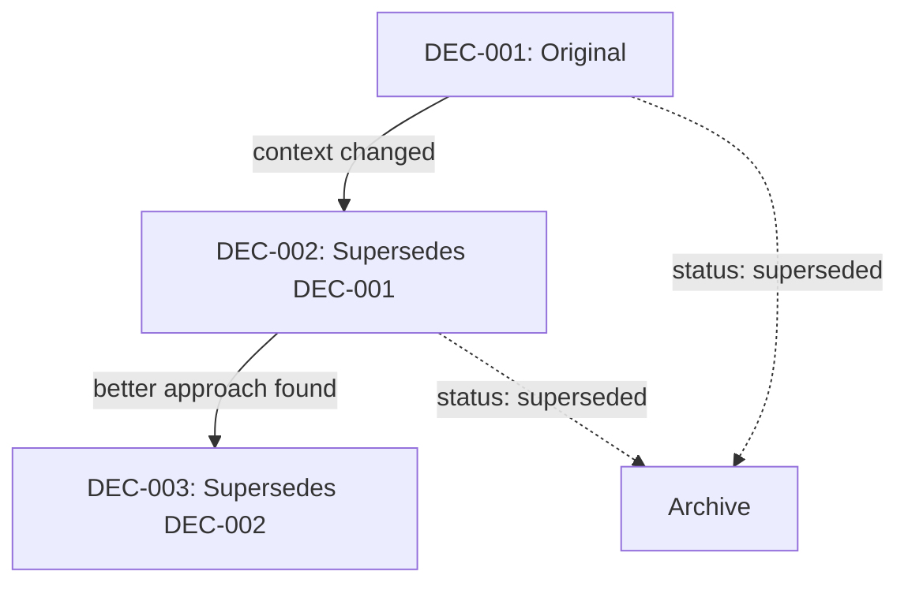

# Decision Management

## What This Is

Decision management tracks Architecture Decision Records (ADRs) and other significant project decisions. Decisions capture the "why" behind important choices, providing context for future maintainers and preventing rehashing of settled debates.

## Why Track Decisions

Code shows *what* was built. Decisions explain *why* it was built that way:
- New team members understand historical context
- Future you remembers why something seemed like a good idea
- Prevents re-litigating settled decisions
- Creates accountability for choices

## Decision Structure

Each decision contains:
- **ID**: Sequential identifier (DEC-001, DEC-002, etc.)
- **Title**: Short summary of the decision
- **Status**: proposed, accepted, deprecated, superseded
- **Context**: What problem or situation prompted this decision
- **Decision**: What was decided
- **Consequences**: Expected positive and negative outcomes

## Operations

### Create

**Purpose**: Record a new decision

Creates a decision file with:
1. Auto-generated ID
2. Title and initial content
3. Creation timestamp
4. Default status (usually "proposed")

**Design choice**: Decisions are immutable by design principle - you don't edit the original decision, you create a new one that supersedes it. Create is intentionally the most important operation.

### View

**Purpose**: Read a single decision with full context

Loads the decision file and returns all content. Useful for:
- Reviewing a decision before implementing
- Citing decisions in discussions
- Onboarding new team members

### List

**Purpose**: See all decisions for overview and discovery

Returns all decisions sorted by ID. Supports filtering by status to see:
- Active decisions (accepted)
- Pending proposals (proposed)
- Historical context (deprecated/superseded)

**Design choice**: List loads all decisions because the typical count is low (tens to hundreds, not thousands). Full-text search would be over-engineering.

### Update

**Purpose**: Modify decision content or status

Updates an existing decision's content or status. The update flow:
1. Load existing decision
2. Parse markdown to identify sections
3. Apply changes
4. Save updated content
5. Optionally commit

**When to use update vs. create new**:
- Status change (proposed → accepted): Update
- Minor typo/clarity fix: Update
- Reversing or significantly changing the decision: Create new with supersedes reference

## Workflow Patterns

### Proposing a Decision

1. Create decision with status "proposed"
2. Share with team for review
3. After discussion, update status to "accepted" or create revised version

### Decision Evolution

### Architecture Review

1. List all decisions
2. Review context for the area being changed
3. Either work within existing decisions or propose new ones
4. Reference decision IDs in code comments and PRs

## Git Integration

Decisions are version-controlled like other backlog content:
- Create commits the new decision file
- Update commits changes with clear commit messages
- History shows decision evolution over time

**Why git for decisions?** Decisions benefit from:
- Blame to see who made decisions
- Diff to see how they evolved
- Branches for proposed changes

## Error Scenarios

### Decision Not Found

**Happens when**: View or update requested for non-existent ID
**Recovery**: Use list to find correct ID, check for typos

### Invalid Update

**Happens when**: Update would violate decision structure (missing required fields)
**Recovery**: Error message shows what's missing, fix and retry

### Concurrent Edit

**Happens when**: Two people update the same decision simultaneously
**Recovery**: Last write wins. For important decisions, coordinate via PR review process instead of direct updates.

The canvas maps errors to `decision.error` with `operation` and `error.stage` attributes for debugging.

## Best Practices

### Decision Titles

Good: "Use PostgreSQL for primary datastore"
Bad: "Database decision"

Titles should be specific enough to understand without opening the file.

### When to Write Decisions

Write a decision when:
- Choice is significant and non-obvious
- Multiple valid options existed
- Future developers might question the choice
- The decision affects multiple parts of the system

Don't write decisions for:
- Obvious choices with one good option
- Temporary workarounds (use tasks instead)
- Implementation details that could easily change
