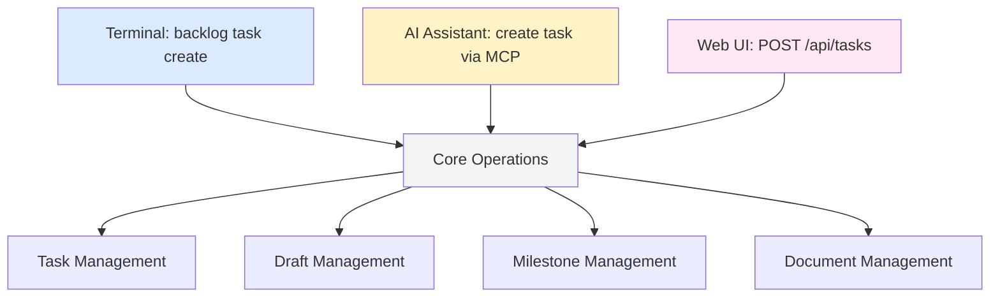

# Entry Points

## What This Is

Backlog.md supports three ways to interact with your backlog: CLI commands, MCP tools for AI assistants, and HTTP API for web interfaces. This canvas shows how requests enter the system and route to core operations.

## The Three Doors



All three entry points converge on the same core operations. This means:
- Same validation rules
- Same error handling
- Same git integration
- Consistent behavior regardless of interface

**Design choice**: Entry points are thin adapters. Business logic lives in core operations, not in CLI/MCP/HTTP layers.

## CLI Entry Point

### What It Is
The `backlog` command-line tool. Runs locally, reads/writes files directly.

### When To Use
- Manual task management
- Scripting and automation
- CI/CD integration
- Local development workflows

### Request Flow
```
backlog task create "Fix bug" → parse args → validate → dispatch to core
```

**Design choice**: CLI uses Commander.js for argument parsing. Validation happens before core dispatch to fail fast on bad input.

### Error Handling
CLI errors exit with non-zero status codes:
- `1` - Validation error (bad arguments)
- `2` - Operation failed (file I/O, git error)
- `3` - Configuration missing (run init first)

This supports shell scripting: `backlog task create "..." || notify-on-failure`

## MCP Entry Point

### What It Is
Model Context Protocol server that exposes Backlog.md as tools for AI assistants (Claude, Cursor, etc.)

### When To Use
- AI-assisted task management
- Conversational backlog queries
- Natural language task creation
- Collaborative planning with AI

### Request Flow
```
AI: "Create a task for fixing login" → MCP tool invocation → validate params → dispatch to core
```

**Design choice**: MCP tools mirror CLI commands. Same operations, same parameters, same validation. The AI translates natural language to structured tool calls.

### Capabilities

AI assistants can:
- Create/edit tasks with natural language
- Query backlog state ("show me blocked tasks")
- Generate reports and summaries
- Suggest task priorities

AI assistants cannot:
- Delete tasks (safety constraint)
- Modify git history
- Change system configuration

**Design choice**: MCP is read-mostly with safe mutations only. Destructive operations require CLI confirmation.

## HTTP Entry Point

### What It Is
RESTful API server for web interfaces and remote clients.

### When To Use
- Browser-based UI
- Mobile apps
- Remote team collaboration
- Real-time updates

### Request Flow
```
POST /api/tasks → parse JSON → validate → dispatch to core → JSON response
```

**Design choice**: HTTP API is stateless. Each request includes full context (no session state). This simplifies deployment and scaling.

### Endpoints

Core operations map to REST resources:
```
GET    /api/tasks       → list tasks
POST   /api/tasks       → create task
GET    /api/tasks/:id   → view task
PATCH  /api/tasks/:id   → edit task
DELETE /api/tasks/:id   → archive task
```

**Design choice**: RESTful design with semantic HTTP methods. GET is safe (no side effects), POST/PATCH/DELETE require write access.

## Operation Dispatch

All three entry points converge on `operation.executed`:

```typescript
// Shared by CLI, MCP, HTTP
await executeOperation({
  operation: 'task.create',
  entityType: 'task',
  params: { title, status }
});
```

The canvas shows this convergence as edges from all three entry points to `operation.executed`.

**Design choice**: Entry points translate their protocol (args, MCP tools, HTTP) to a common operation format. Core doesn't know which entry point called it.

## Authentication & Authorization

### CLI
- No auth required (local filesystem access = authorization)
- Respects file permissions
- Honors gitignore

### MCP
- Runs as local server (stdio transport)
- Same permissions as CLI
- No network exposure

### HTTP
- Optional authentication (bearer tokens, OAuth)
- CORS configuration for web clients
- Rate limiting per client

**Design choice**: Security model matches access pattern. CLI/MCP are local-only (no auth), HTTP requires auth when exposed to network.

## Error Propagation

Errors bubble up through entry points:

```
Core Operation Error
  ↓
Entry Point Handler
  ↓
User-Facing Format
  - CLI: stderr + exit code
  - MCP: error response to AI
  - HTTP: JSON error + status code
```

The canvas shows this as edges from operation nodes to `entry.error`.

**Design choice**: Core throws typed errors. Entry points catch and format for their protocol. Same error, different presentation.

## Concurrency Behavior

### CLI
- Single-process, synchronous
- Operations complete before next command
- File locks prevent concurrent edits

### MCP
- Async I/O but sequential operations
- AI requests are queued
- No parallel task mutations

### HTTP
- Concurrent requests supported
- Last-write-wins for conflicts
- Consider request IDs for idempotency

**Design choice**: Core operations are not thread-safe. Entry points serialize access to prevent corruption.

## Performance Characteristics

Entry point overhead (before core operation runs):

- **CLI**: ~5ms (argument parsing)
- **MCP**: ~10ms (JSON-RPC handling)
- **HTTP**: ~15ms (request parsing + routing)

These are negligible compared to core operations (50-500ms depending on operation).

## Development Workflow

When adding a new operation:

1. Implement in core (`src/core/backlog.ts`)
2. Add CLI command (`src/cli.ts`)
3. Add MCP tool (`src/mcp/tools.ts`)
4. Add HTTP endpoint (`src/server/routes.ts`)

Entry points should be thin wrappers. If an entry point has >20 lines for a single operation, consider moving logic to core.

## Future Entry Points

Potential additions:
- **Git hooks** - Task lifecycle based on git events
- **File watchers** - Auto-sync on external file changes
- **Webhook receiver** - Integration with external systems (JIRA, GitHub)

The canvas structure supports adding new entry points without changing core operations.
