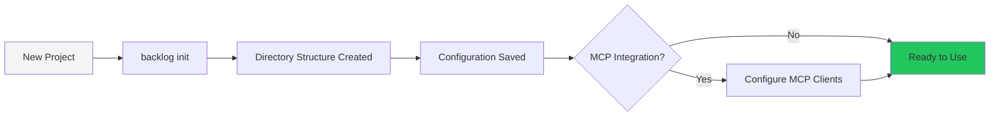

# Initialization

## What This Is

The init command sets up a new Backlog.md workspace. It creates the directory structure, configuration file, and optionally integrates with MCP clients for IDE/AI tool support.

## Lifecycle



## What Gets Created

### Directory Structure
```
project/
├── backlog/              # Active tasks
├── backlog/drafts/       # Quick-capture drafts
├── backlog/archive/      # Completed tasks
├── backlog/milestones/   # Project milestones
├── backlog/docs/         # Documentation
└── .backlog.config.json  # Project configuration
```

**Design choice**: Nested directories under `backlog/` keep everything contained. You can `.gitignore` the entire `backlog/` directory if needed, or commit it for team collaboration.

### Configuration File

The `.backlog.config.json` contains:
- `projectName` - Display name for your project
- `taskPrefix` - ID prefix (e.g., "PROJ" → PROJ-123)
- `autoCommit` - Whether to auto-commit task changes
- `zeroPaddedIds` - ID padding width (3 → PROJ-001)
- `defaultEditor` - Editor command for task editing

**Design choice**: JSON file instead of YAML for easier programmatic updates. The CLI can modify this file as settings change.

## Operation Modes

### Fresh Initialization
First-time setup in a new project:
```bash
cd my-project
backlog init --project-name "My Project"
```

Creates all directories and config from scratch.

### Re-initialization
Running init in an existing workspace:
```bash
backlog init --project-name "New Name"
```

Updates configuration without destroying existing tasks. Useful for:
- Changing project settings
- Adding MCP integration after initial setup
- Fixing corrupted directory structure

**Design choice**: Re-init is idempotent and non-destructive. It creates missing directories but never deletes existing tasks.

## MCP Integration

MCP (Model Context Protocol) lets AI tools interact with your backlog:

```bash
backlog init --mcp claude,cursor
```

This adds Backlog.md tools to your AI assistant's capabilities:
- Create/edit tasks from chat
- Query backlog state
- Generate task reports

**When to use MCP**:
- You use Claude Desktop, Cursor, or other MCP clients
- You want AI to help manage your backlog
- You work conversationally with AI assistants

**When to skip MCP**:
- CLI-only workflow
- Team doesn't use AI tools
- Security concerns about AI accessing project data

**Design choice**: MCP integration is optional and configured separately per client. Each team member can enable/disable independently based on their workflow.

## Configuration Options

### Task ID Format

```bash
# Short numeric IDs
backlog init --task-prefix "T"
# → T-1, T-2, T-3

# Zero-padded IDs
backlog init --task-prefix "PROJ" --zero-padded 4
# → PROJ-0001, PROJ-0002

# Prefix-only (no numbers)
backlog init --task-prefix "TASK"
# → TASK-1
```

**Design choice**: Flexible ID format supports different workflows:
- Short IDs for personal projects
- Prefixed IDs for multi-repo organizations
- Zero-padding for sortability in file listings

### Auto-commit Behavior

```bash
# Auto-commit every task change
backlog init --auto-commit

# Manual commits only (default)
backlog init
```

**Trade-offs**:
- **Auto-commit**: Audit trail per task, but noisy git history
- **Manual commit**: Clean history, but requires discipline

Most teams start with manual commits, then enable auto-commit if they need granular history.

## Error Scenarios

### Directory Already Exists
**Happens when**: Running init where backlog/ already exists
**Behavior**: Skips directory creation, updates config only
**Recovery**: No recovery needed - this is safe

### Git Repository Not Initialized
**Happens when**: Running init outside a git repository
**Behavior**: Continues without git integration warnings
**Recovery**: Run `git init` then re-init if you want git features

### MCP Client Configuration Failure
**Happens when**: MCP client isn't installed or config path is wrong
**Behavior**: Partial success - backlog works but MCP integration skipped
**Recovery**: Fix MCP client installation then run `backlog init --mcp <client>` again

The canvas tracks these as `init.error` events with `error.stage` showing where it failed:
- `error.stage: "structure"` → Directory creation failed
- `error.stage: "config"` → Config file write failed
- `error.stage: "mcp"` → MCP integration failed

## Re-initialization Scenarios

### Changing Project Name
```bash
backlog init --project-name "Better Name"
```
Updates config only, preserves all tasks.

### Adding MCP After Initial Setup
```bash
backlog init --mcp claude
```
Adds MCP integration without touching existing structure.

### Fixing Corrupt Directory
```bash
rm -rf backlog/drafts  # Accidentally deleted
backlog init           # Recreates missing directories
```

**Design choice**: Init is safe to run repeatedly. It only creates missing pieces, never destroys existing data.

## Performance Characteristics

- **Fresh init**: ~10ms (creates 5 directories + 1 config file)
- **Re-init**: ~5ms (checks existence, updates config)
- **MCP config**: +50-100ms per client (writes to client config files)

Init is fast enough to run on every CI build without noticeable delay.

## Integration with Other Features

After init completes, the workspace is ready for:
- **Task creation** → `backlog task create`
- **Draft capture** → `backlog draft create`
- **Milestone planning** → `backlog milestone create`

The canvas shows init as a one-time setup, separate from recurring task operations.
