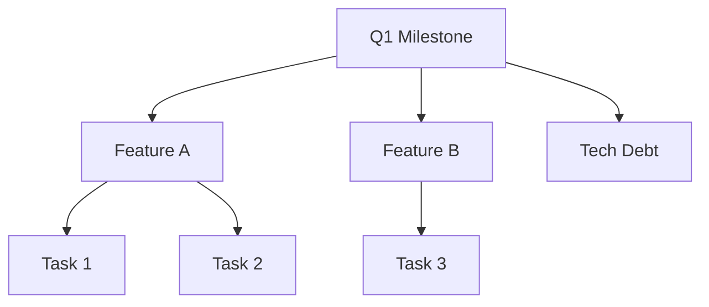

# Milestone Management

## What This Is

Milestone management organizes tasks into larger goal-oriented groups. Milestones represent significant project checkpoints - releases, phases, or deliverables that multiple tasks contribute to.

## Why Milestones

Tasks are the atomic unit of work. But work usually groups into larger goals:
- "Ship v2.0" encompasses many tasks
- "Complete security audit" has prerequisites and deliverables
- "Q1 Objectives" organizes a quarter's work

Milestones provide that grouping without adding hierarchy complexity.

## Milestone Structure

Each milestone contains:
- **ID**: Sequential identifier (MS-001, MS-002, etc.)
- **Title**: The goal or checkpoint name
- **Description**: Details about what this milestone represents
- **Status**: Planning, active, completed, archived
- **Created**: When the milestone was established

## Operations

### Create

**Purpose**: Establish a new project milestone

Creates a milestone file with:
1. Auto-generated ID
2. Title and description
3. Initial status (usually "planning")
4. Creation timestamp

**Design choice**: Milestones are lightweight containers. They don't enforce task relationships - tasks reference milestones, not vice versa.

### View

**Purpose**: See milestone details and potentially linked tasks

Loads a milestone's full information. Can be extended to show tasks tagged with this milestone.

### List

**Purpose**: See all milestones for project planning

Returns all milestones, optionally including archived ones. Useful for:
- Sprint/release planning
- Progress tracking
- Historical reference

**Design choice**: List separates active from archived by default. You usually want to see current milestones, not completed ones.

### Archive

**Purpose**: Mark a milestone as complete and move to archive

The archive operation:
1. Locates the milestone
2. Moves to archive directory
3. Optionally commits

**When to archive**:
- Milestone is complete
- Milestone was cancelled
- Cleaning up old planning artifacts

**Design choice**: Archive doesn't require all linked tasks to be complete. You might archive a milestone that was partially completed or cancelled.

## Workflow Patterns

### Release Planning

1. Create milestone for the release (MS-001: "v2.0 Release")
2. Create tasks, tag them with milestone ID
3. Track progress by querying tasks for that milestone
4. When released, archive the milestone

### Quarterly Planning

1. Create quarterly milestone
2. Create feature milestones as sub-goals
3. Tasks link to the most specific milestone
4. Roll up progress by milestone

### Agile Sprints

1. Create milestone for each sprint
2. During planning, assign tasks to sprint milestone
3. During sprint, filter tasks by current milestone
4. At sprint end, archive milestone (complete or not)

## Git Integration

Milestone operations support auto-commit:
- Create: Commits new milestone
- Archive: Commits the archive move

**Why version milestones?**
- History of what you planned vs. delivered
- Blame shows who created/changed milestones
- Can restore archived milestones if needed

## Error Scenarios

### Milestone Not Found

**Happens when**: View or archive for non-existent milestone
**Recovery**: Use list to find correct ID, check archived milestones

### Duplicate Title

**Happens when**: Creating milestone with same title as existing one
**Recovery**: Use different title, or reference existing milestone

### Archive with Active Tasks

**Happens when**: Archiving milestone while tasks still reference it
**Recovery**: Not an error - tasks keep their milestone reference. You can still query by archived milestone ID.

The canvas maps errors to `milestone.error` with:
- `operation`: create, view, list, archive
- `error.stage`: Where it failed
- `identifier`: Which milestone (if applicable)

## Milestones vs Tags vs Projects

| Concept | Use For | Example |
|---------|---------|---------|
| Milestone | Time-bound goals | "v2.0 Release", "Q1 OKRs" |
| Tag | Cross-cutting categories | "security", "performance" |
| Project | Separate workstreams | Different repos/teams |

Milestones are temporal groupings. Tags are categorical. Use both together for rich organization.

## Performance Characteristics

- **Create**: O(1) - writes one file
- **View**: O(1) - reads one file
- **List**: O(n) - reads all n milestones
- **Archive**: O(1) - moves one file

Milestones are designed for low volume (tens, not thousands). If you need more, consider project/portfolio tools.

## Best Practices

### Milestone Scope

Keep milestones achievable:
- Good: "Launch beta to 100 users"
- Too big: "Make the app successful"
- Too small: "Fix button color"

### Milestone Titles

Use outcome-oriented titles:
- Good: "Enable self-service signups"
- Bad: "Sprint 47" (what does that accomplish?)

### Milestone Lifecycle

Don't let milestones linger:
1. Planning → Active when work begins
2. Active → Archived when done (or cancelled)
3. Review archived milestones quarterly for patterns
