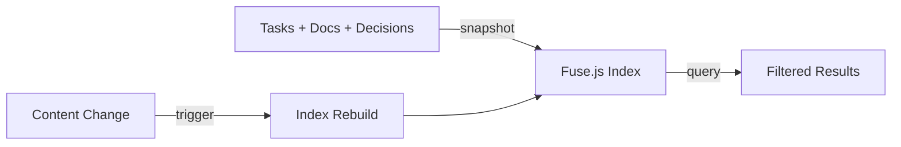

# Search Operations

## What This Is

Search operations provide cross-entity full-text search across tasks, documents, and decisions. Instead of browsing individual entity types, search lets you find anything by content.

## Why Unified Search

As backlogs grow, finding things becomes harder:
- "What was that task about caching?"
- "Which decision covered our API versioning?"
- "Where did we document the deployment process?"

Search answers these questions across all entity types at once.

## Search Architecture

Search uses Fuse.js for fuzzy matching:
1. **Initialization**: Build index from all entities
2. **Query**: Search the index with user query
3. **Filter**: Apply type/criteria filters to results
4. **Update**: Rebuild index when content changes

## Operations

### Initialize

**Purpose**: Build the search index on startup

The initialization flow:
1. Load snapshot of all entities (tasks, documents, decisions)
2. Transform into searchable format
3. Build Fuse.js index

**Design choice**: Build index once at startup, update incrementally. This trades memory for query speed - the index stays in memory.

### Query

**Purpose**: Execute a search and return results

Query processing:
1. Normalize the search string
2. Execute Fuse.js search on index
3. Filter by entity type if specified
4. Apply additional criteria (status, date, etc.)
5. Return ranked results

**Design choice**: Fuzzy matching by default. Searching "authantication" finds "authentication". This helps with typos and partial recall.

### Index Update

**Purpose**: Keep index current as content changes

When entities change (create, update, delete):
1. Detect the change (via content version)
2. Load new snapshot
3. Rebuild index with new data

**Design choice**: Full rebuild on change rather than incremental. For typical workloads (<10k entities), rebuild is fast enough. Simplicity over optimization.

## Query Capabilities

### Basic Search

Simple keyword search:
- `login` - finds all entities mentioning "login"
- `api error` - finds entities with both terms

### Type Filtering

Limit results to specific entity types:
- Types: task, document, decision
- Search "deployment" in documents only

### Filter Combinations

Combine search with filters:
- "database" + status:todo → Tasks about databases that need doing
- "architecture" + type:decision → Architecture decisions

## Workflow Patterns

### Finding Related Work

1. Starting a new feature? Search for existing related work
2. Review results across tasks, docs, decisions
3. Link or reference relevant items

### Knowledge Discovery

1. New team member searches "how to deploy"
2. Finds deployment document, related tasks, and deployment decisions
3. Gets full context without asking around

### Impact Analysis

1. Search for component name before changing it
2. See all tasks, docs, decisions that mention it
3. Understand impact scope

### Duplicate Detection

1. Before creating a task, search for similar ones
2. Find existing task instead of creating duplicate
3. Or reference existing task in new one

## Performance Characteristics

### Initialization
- Time: O(n) where n = total entities
- Memory: O(n) for the index
- Happens once at startup

### Query
- Time: O(log n) for Fuse.js search + O(k) for filtering k results
- Very fast for interactive use

### Index Update
- Time: O(n) for full rebuild
- Triggered by content changes
- Fast enough for typical workloads

**Scaling limits**: Search is designed for interactive backlog sizes. Above ~10k entities, consider:
- External search tools (Elasticsearch)
- Database-backed search
- Incremental index updates

## Error Scenarios

### Initialization Failure

**Happens when**: Can't load content snapshot
**Recovery**: Check filesystem permissions, entity file corruption

### Query Failure

**Happens when**: Index not initialized, invalid query format
**Recovery**: Wait for initialization, simplify query

### Update Failure

**Happens when**: Can't rebuild index after content change
**Recovery**: Search continues working with stale index, retry update

The canvas maps errors to `search.error` with:
- `operation`: initialize, query, index_update
- `error.stage`: Where in the flow it failed

## Index Content

What gets indexed per entity type:

### Tasks
- ID (exact match)
- Title (fuzzy)
- Description (fuzzy)
- Tags (exact)
- Status (exact)

### Documents
- ID (exact match)
- Title (fuzzy)
- Content (fuzzy)

### Decisions
- ID (exact match)
- Title (fuzzy)
- Status (exact)
- Context/Decision text (fuzzy)

**Design choice**: Index searchable fields, not all fields. Created/updated dates aren't indexed - use filters for date ranges.

## Search vs List

| Operation | Use When |
|-----------|----------|
| Search | You know keywords but not entity type |
| List | You know entity type, want to browse/filter |

Search is discovery. List is inventory.

## Best Practices

### Write Searchable Content

Make titles and descriptions searchable:
- Include keywords you'd search for
- Avoid abbreviations without expansion
- Use consistent terminology

### Use Tags for Categorization

Tags enable filtered search:
- Tag tasks with component names
- Tag docs with topic areas
- Search within tags for precision

### Regular Index Health

If search seems stale:
1. Check for recent content changes
2. Verify index update events in logs
3. Restart to force full rebuild if needed
