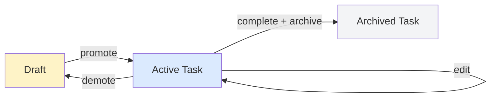

# Task Management

## What This Is

Task management is the core workflow engine of Backlog.md. Tasks move through a lifecycle from creation to completion to archival, with operations that support different work styles and project phases.

## Task Lifecycle



A task starts as either a draft (quick capture) or directly as an active task (when you know what you need). Active tasks can be edited, viewed, and listed. When complete, they're archived. If you realize a task isn't ready, demote it back to draft.

## Operations

### Create
**Purpose**: Capture new work with full metadata

Creates a task file in `backlog/` with:
- Unique ID (auto-generated)
- Title, description, status
- Optional tags, assignee, priority
- Timestamp metadata

**Design choice**: We validate and generate the ID early so failures happen before touching the filesystem. This prevents orphaned files.

### Edit
**Purpose**: Update task metadata as work progresses

Loads the existing task, merges changes, and saves. Tracks which fields actually changed for git commit messages.

**Design choice**: Load before mutate. This catches concurrent edits (file modified since you started editing) and gives better error messages.

### View
**Purpose**: Display a single task with all details

Reads task file and optionally loads related data (subtasks, parent tasks). Supports different formats (JSON, markdown, terminal UI).

**Design choice**: View can load from other git branches (cross-branch viewing). This lets you see tasks from feature branches without switching.

### List
**Purpose**: Query and filter tasks for different views

Loads all tasks from `backlog/`, applies filters, returns results. Supports filtering by:
- Status (todo, in-progress, blocked, complete)
- Tags
- Assignee
- Date ranges

**Design choice**: Load everything then filter in-memory. For typical workloads (<10k tasks), this is faster than maintaining an index. We trade memory for simplicity.

### Demote
**Purpose**: Convert a task back to draft status

Moves the task file from `backlog/` to `backlog/drafts/`. Preserves all metadata - this isn't deletion, it's reclassification.

**When to use**:
- Task isn't well-defined yet
- Blocked indefinitely and cluttering active list
- Splitting a task and want to park pieces

**Design choice**: Physical file move (not status field) makes drafts invisible to normal task queries. You opt-in to seeing drafts, they don't pollute the active workspace.

### Archive
**Purpose**: Remove completed tasks from active view

Moves task from `backlog/` to `backlog/archive/`. Like demote, this is a file move, not deletion.

**When to use**:
- Task is complete and you want to clean up
- Quarterly/milestone-based cleanup
- Preparing workspace for new project phase

**Design choice**: Archive preserves full task history. You can always `git log backlog/archive/` to see what was completed. This supports retrospectives and audits.

## Workflow Patterns

### Quick Capture → Refinement
1. Create draft with just a title (`backlog draft create "Fix the thing"`)
2. Later, promote to task when ready to plan (`backlog draft promote DRAFT-123`)
3. Edit to add details as you work

### Sprint Planning
1. List all tasks filtered by status=todo
2. Edit selected tasks to set priority/assignee
3. Track progress with list views throughout sprint
4. Archive completed tasks at sprint end

### Cross-Branch Feature Work
1. Create feature branch with git
2. Create tasks specific to that feature
3. From main branch, use view to check feature branch tasks
4. Merge feature branch when done, tasks come with it

## Git Integration

All mutation operations (create, edit, demote, archive) optionally auto-commit:

```bash
backlog task create "Add login" --auto-commit  # Commits immediately
backlog task create "Add login"                # No commit, you decide
```

**Why optional?** Some workflows want atomic commits per task change. Others batch multiple task operations then commit manually.

The canvas shows this as conditional flow - the `.committed` step only happens when auto-commit is enabled.

## Error Scenarios

### Task Not Found
**Happens when**: ID doesn't match any file in `backlog/`
**Recovery**: Use `list` to see available tasks, or check if it's in drafts/archive

### Concurrent Edit
**Happens when**: Two processes edit the same task simultaneously
**Recovery**: Last write wins. We emit events showing which fields changed for manual conflict resolution.

### Git Commit Failure
**Happens when**: Git hooks reject commit, or working tree is dirty
**Recovery**: Task is saved but not committed. User can commit manually or fix git state and retry.

The canvas maps these to `task.error` with `error.stage` showing where the failure occurred.

## Performance Characteristics

- **Create**: O(1) - writes one file
- **Edit**: O(1) - read one file, write one file
- **View**: O(1) - read one file (+ O(k) for k subtasks)
- **List**: O(n) - reads all n task files, filters in memory
- **Demote/Archive**: O(1) - moves one file

The canvas events include `duration.ms` attributes so you can measure actual performance in your workload.

## Future Considerations

What this canvas doesn't cover (potential future work):

- **Task dependencies** - Parent/child relationships are stored but not enforced
- **Recurring tasks** - No built-in support for task templates or recurrence
- **Batch operations** - Each operation acts on one task; no bulk edit
- **Locking** - Concurrent edits aren't prevented, just detected after the fact

These could be separate canvases if the features are added.
